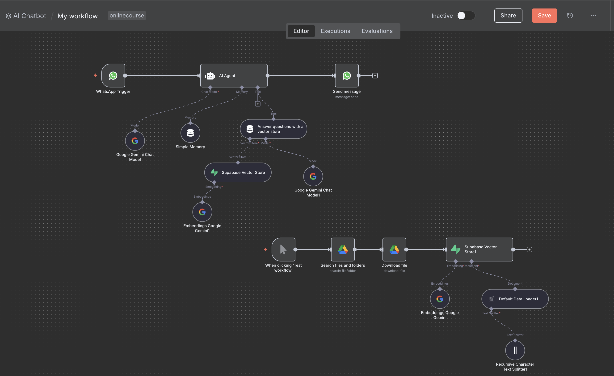

# 🤖 AI WhatsApp Chatbot using n8n, Supabase & Google Gemini

This repository contains a no-code/low-code WhatsApp chatbot system built using [n8n](https://n8n.io). The bot responds to user queries (e.g. events, classes, or venues) based on uploaded schedules/documents by embedding them into a vector database (Supabase) and retrieving relevant answers via AI.

---

## 🧠 How It Works

This system consists of two main **n8n workflows**:

### 1️⃣ Input Data Workflow (Auto-Embedding Pipeline)
- Pulls daily documents from a specific Google Drive folder
- Downloads the file
- Processes and splits text
- Embeds the content using **Google Gemini Embeddings**
- Stores it in **Supabase Vector Store** for retrieval

### 2️⃣ Chatbot Workflow (User Interaction)
- Triggered by **incoming WhatsApp messages**
- Passes the question to **LangChain agent**
- Queries Supabase (RAG) for relevant content
- Responds intelligently using **Google Gemini Chat API**
- Sends the reply back via WhatsApp

---

## 🚀 Features

- ✅ Google Drive automated sync
- ✅ Supabase vector store for semantic search
- ✅ Google Gemini for chat & embedding
- ✅ WhatsApp integration (via Meta's API)
- ✅ LangChain agent memory for better conversations
- ✅ Language mixed support (BM-English style)

---

## 🛠️ Technologies Used

| Tool/Platform    | Purpose                        |
|------------------|--------------------------------|
| n8n              | No-code automation engine      |
| WhatsApp API     | Message triggers & replies     |
| Google Gemini    | AI model for chat + embeddings |
| Supabase         | Vector store (RAG system)      |
| Google Drive     | Document source                |
| LangChain        | Orchestrating AI pipelines     |

---

## 🔧 Setup Guide

> ⚠️ Prerequisites:
> - WhatsApp Business Account
> - Google Drive with documents
> - Supabase Project (with vector table setup)
> - Google Gemini API key
> - n8n (cloud or self-hosted)

---

### 🗂 Import Workflow

1. Open your n8n instance.
2. Go to **Workflow → Import from file**
3. Select `workflows/AI_Chatbot_n8n.json`

---

### 🔌 Configure Credentials in n8n

- WhatsApp API credentials
- Google Drive OAuth
- Google Gemini API key
- Supabase API key

---

---

## 🖼️ Workflow Overview

Here is a screenshot of the complete n8n workflow used for this WhatsApp chatbot automation:

---

## 👤 Author

Developed by [Muhammad Haikal Haziq](https://github.com/kalhaziq)

---

